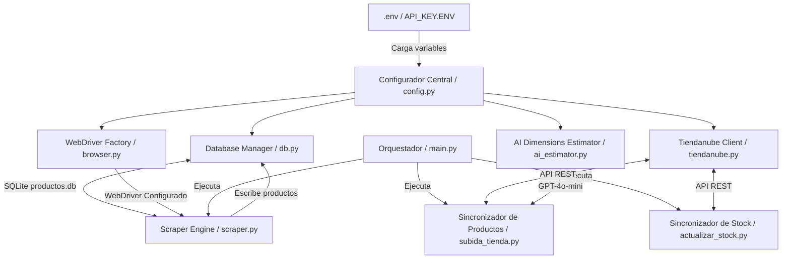

# JG-STORE Scraping & Sincronización

Este proyecto es un sistema modular, robusto y automatizado para extraer productos desde el catálogo de **Coronel Mayorista** (utilizando Selenium) y sincronizarlos (actualizando precios, stock, imágenes y dimensiones) directamente en la plataforma **Tiendanube** (utilizando su API REST).

El sistema cuenta con estimación inteligente de peso y dimensiones mediante IA (OpenAI GPT-4o-mini) y tolerancia a fallos.

---

## 🏗️ Arquitectura del Proyecto

El proyecto ha sido refactorizado en una arquitectura limpia y desacoplada de 4 capas:



- **`config.py`**: Centraliza y valida todas las variables de entorno.
- **`app/core/`**:
  - `browser.py`: Fábrica unificada para Selenium WebDriver (Chrome).
  - `db.py`: Controlador de base de datos SQLite (`productos.db`), encapsulando todas las consultas SQL.
- **`app/services/`**:
  - `tiendanube.py` (`TiendanubeClient`): Interfaz unificada de comunicación con la API de Tiendanube. Implementa control de Rate Limiting y caché local en disco para evitar peticiones redundantes.
  - `ai_estimator.py`: Estima dimensiones de envío por lote usando IA, con fallback tolerante a fallos (valores por defecto) si la clave de OpenAI no está configurada o la API falla.

---

## 📋 Requisitos Previos

1. **Python 3.8+** instalado.
2. **Google Chrome** instalado.
3. Dependencias instaladas:
   ```bash
   pip install -r requirements.txt
   ```

---

## ⚙️ Configuración y Credenciales

El configurador central de seguridad buscará las credenciales en la raíz del proyecto. Soporta múltiples nombres de archivo para compatibilidad con Windows (incluyendo extensiones ocultas):
- `API_KEY.ENV` / `API_KEY.ENV.txt`
- `.env`
- `api_key.env` / `api_key.env.txt`

Crea uno de estos archivos y define el siguiente contenido:

```env
# Credenciales Coronel Mayorista
CORONEL_CUIT=tu_cuit_del_mayorista
CORONEL_PASSWORD=tu_contraseña_del_mayorista

# Credenciales Tiendanube
TIENDANUBE_STORE_ID=tu_id_de_tienda
TIENDANUBE_ACCESS_TOKEN=tu_token_de_acceso_tiendanube
TIENDANUBE_USER_AGENT=API-KEY (tu_correo@gmail.com)

# API Key OpenAI (Para dimensiones estimadas con IA)
OPENAI_API_KEY=sk-proj-xxxx...
```

*Nota: Si `OPENAI_API_KEY` no se define, el sistema continuará funcionando utilizando valores de peso y dimensiones estándar (0.05) para los envíos.*

---

## 🚀 Ejecución Simplificada (Recomendado para Clientes)

Para la comodidad del usuario final, se incluye un lanzador interactivo:

1. **Doble Clic** en el archivo [Sincronizar_JG_Store.bat](file:///d:/Repositorios/Scraping-Coronel/Sincronizar_JG_Store.bat) en la raíz del proyecto.
2. Se abrirá una ventana de consola con un menú interactivo numerado.
3. Seleccione la tarea deseada (ej. `1` para el flujo rápido de scraping + subida) y configure los valores sugeridos presionando **Enter**.

---

## 💻 Uso Avanzado mediante CLI (`main.py`)

El punto de entrada principal del sistema es `main.py`, que expone una interfaz de comandos (CLI) estructurada mediante **subcomandos**:

### 1. Extraer Catálogo (`scrape`)
Navega por Coronel Mayorista y guarda los productos actuales en la base de datos local SQLite.
```bash
python -X utf8 main.py scrape [opciones]
```
**Opciones disponibles:**
- `-g`, `--ganancia`: Porcentaje de incremento de precio a aplicar (ej. `40` para 40%). Si no se especifica, se preguntará interactivamente.
- `-d`, `--download-images`: Descargar imágenes localmente en la carpeta `img-scraping` (`t` para activar, `f` para desactivar).
- `-y`, `--no-prompt`: Ejecución automática sin prompts. Usa valores por defecto si no se especifican.

### 2. Sincronizar Productos (`sync`)
Compara la base de datos local SQLite con Tiendanube, sube los productos nuevos y actualiza precios y descripciones de los existentes.
```bash
python -X utf8 main.py sync [opciones]
```
*(Mismas opciones que `scrape`)*

### 3. Actualizar Stocks (`stock`)
Navega rápidamente por el mayorista para ver qué productos están activos. Los productos encontrados en el catálogo mayorista se actualizarán con stock "infinito" (999999). Los que ya no figuren se marcarán con stock `0` y se ocultarán en Tiendanube si no tienen variantes disponibles.
```bash
python -X utf8 main.py stock
```

### 4. Flujo Completo (`full-run`)
Ejecuta secuencialmente todo el pipeline de automatización de una sola vez: `scrape` ➡️ `sync` ➡️ `stock`.
```bash
python -X utf8 main.py full-run [opciones]
```

### 5. Flujo Parcial (`scrape-sync`)
Ejecuta secuencialmente el scraping de catálogo y la sincronización de productos a Tiendanube, sin realizar la actualización rápida de stocks o inactivaciones (`scrape` ➡️ `sync`).
```bash
python -X utf8 main.py scrape-sync [opciones]
```
*(Mismas opciones que `scrape`)*

---

## 🔄 Compatibilidad Retrospectiva

Si prefieres seguir ejecutando los scripts tradicionales de forma individual, puedes hacerlo sin problemas. Han sido adaptados para delegar su ejecución internamente en los servicios centralizados de `main.py`:

- **`python -X utf8 scraping_coronel.py`**: Equivale a `python main.py scrape` y pregunta si deseas proceder a la subida al finalizar.
- **`python -X utf8 subida_tienda.py`**: Equivale a `python main.py sync`.
- **`python -X utf8 actualizar_stock.py`**: Equivale a `python main.py stock`.

*Tip: Recomendamos anteponer `python -X utf8` al ejecutar los scripts para evitar problemas con la codificación de caracteres especiales/emojis en la consola de Windows.*

---

## 🛠️ Notas de SQLite y Logs

- La base de datos local se aloja en `productos.db` y se crea automáticamente en su primera ejecución.
- Si deseas depurar peticiones de IA, el sistema genera automáticamente reportes en la carpeta `openai_logs/` en formato JSON y texto plano.
- Las respuestas de productos de Tiendanube se guardan localmente en caché dentro de la carpeta `app/api_cache/` para agilizar sustancialmente los tiempos de respuesta.
